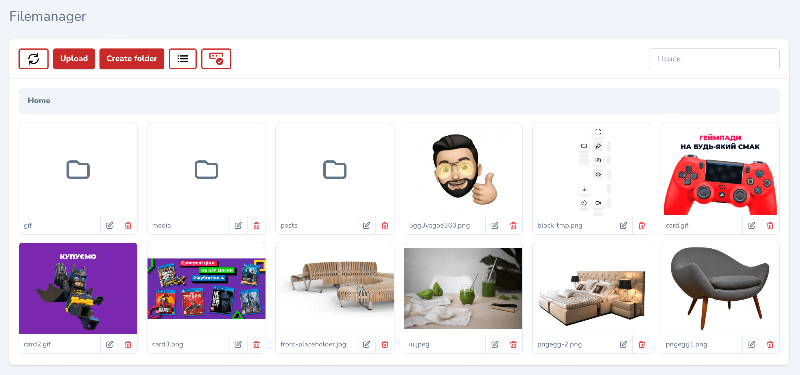
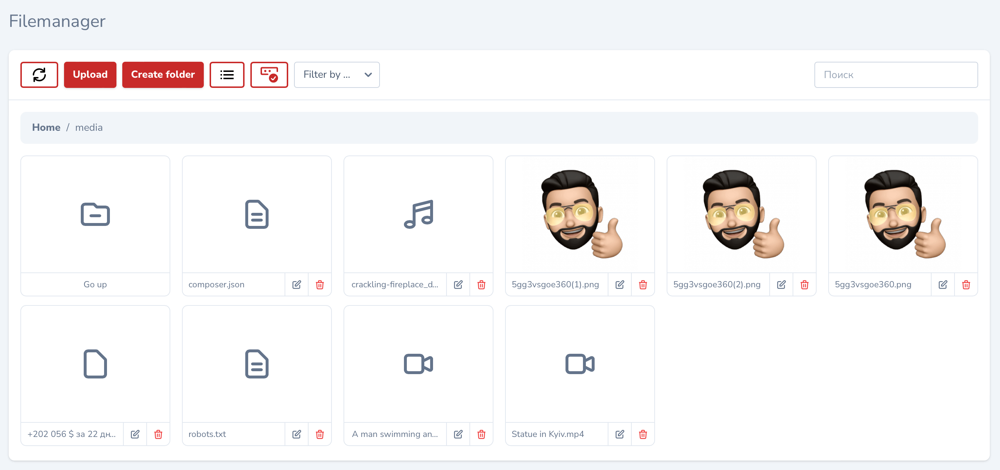
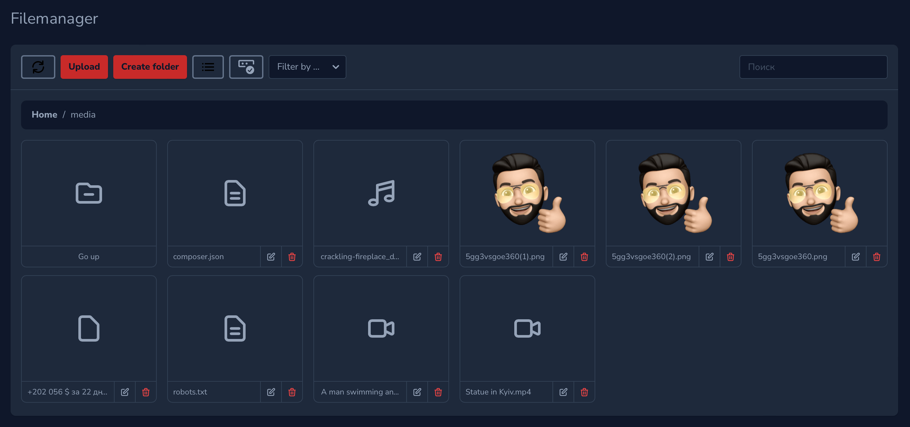
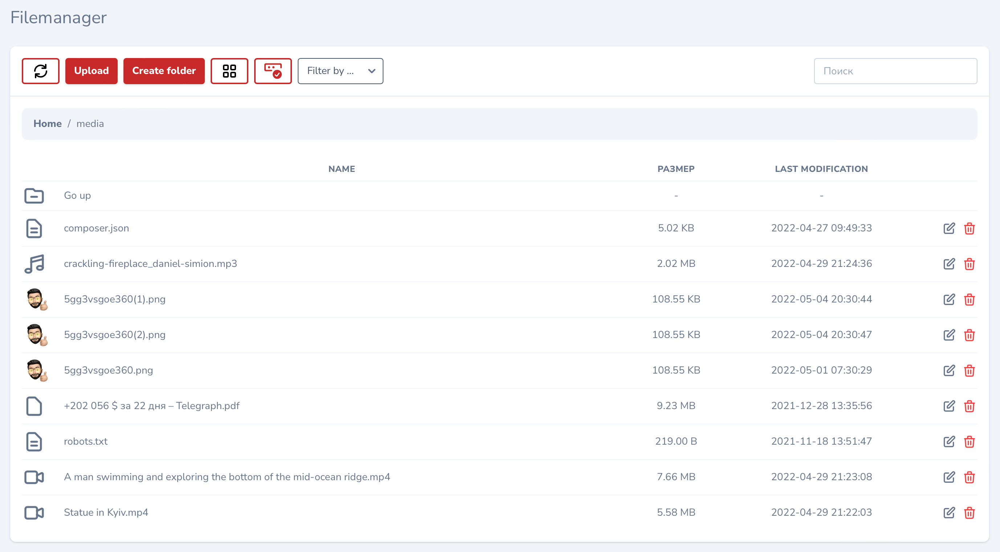
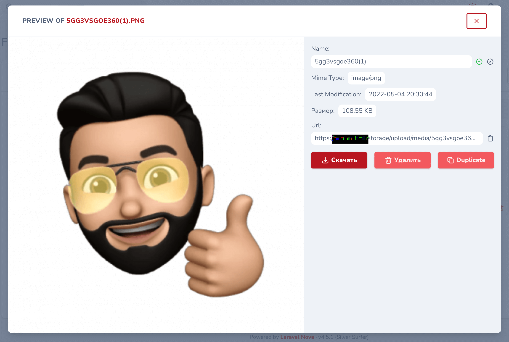
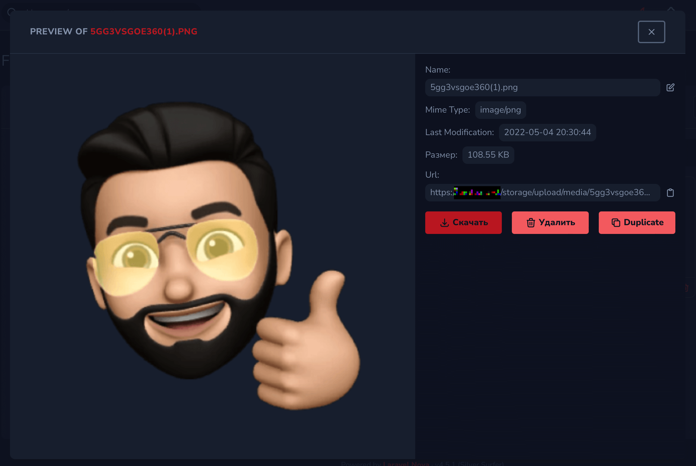

# Filemanager tool for Laravel Nova

[](https://packagist.org/packages/stepanenko3/nova-filemanager)

A quick fix/update to make it all work ... more or less. All credits to [Artem Stepanenko](https://github.com/stepanenko3) for his awesome work. 

A Filemanager Tool and Field for Laravel Nova



## Installation

```bash
composer require kreatorij/nova-filemanager
```

## Screenshots







### Changelog

Please see [CHANGELOG](CHANGELOG.md) for more information on what has changed recently.

### Security

If you discover any security related issues, please using the issue tracker.

## Credits

- [Artem Stepanenko](https://github.com/stepanenko3)
- [Eric Lagarda](https://github.com/Krato)
- [Spatie Nova Tool Skeleton](https://github.com/spatie/skeleton-nova-tool)

## Contributing

Thank you for considering contributing to this package! Please create a pull request with your contributions with detailed explanation of the changes you are proposing.

## License

This package is open-sourced software licensed under the [MIT license](LICENSE.md).
